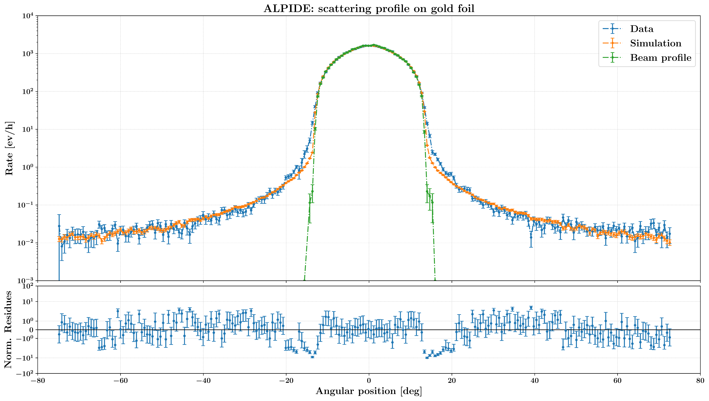

# Rutherford Scattering

In this repository we present all the code written for the analysis of Rutherford Scattering measurements with both SSB and ALPIDE detectors. These were performed in the laboratories of Polo Didattico (via Loredan) at the University of Padua, for the course of Advanced Physics Laboratory.

    

## Authors

* [**Rocco Ardino**](https://github.com/RoccoA97) (University of Padua)
* [**Gabriele Bortolato**](https://github.com/Gabriele-bot) (University of Padua)
* [**Alessandro Valente**](https://github.com/mastrovalentz) (University of Padua)

## Abstract
In this work we discuss the construction of an experimental apparatus for Rutherford Scattering measurements. In particular, we treat in detail each module of its composite structure and we present the operations done for their characterisation. Moreover, we treat the implementation of a numerical simulation to model with first order approximations the apparatus and we compare the experimental data for the angular scattering distribution with the expected results. Lastly, we give statistical significance to the results through several standard test statistics and we discuss the agreement between theory and experiment.

## Experimental data
The experimental data acquired with ALPIDE detector are available inside the `analysis` subfolder, while the waveforms acquired with the SSB detector are too heavy for GitHub. So, in order to run the code for SSB analysis, a folder `data/` must be created inside this repository and one should put inside it the experimental data folder, available in the laboratory `lxapix01` machine. Contact us for more information.

## Structure of the repository

The repository is organized as follows:
- **`analysis`**: this folder contains the code needed to analyse the experimental data from SSB and ALPIDE detectors;
- **`hardware`**: this folder contains the firmware for ALPIDE and FPGA, needed to control the acquisition from this detection system;
- **`plots`**: this folder contains the code needed to realise all the plots showed in the final report of the project;
- **`report`**: this folder contains the source code for the final report, showing the results of the project;
- **`simulations`**: this folder contains the code for the numerical simulation of the experiment and of the apparatus;
- **`tests`**: alpha stuff, just experiments.
